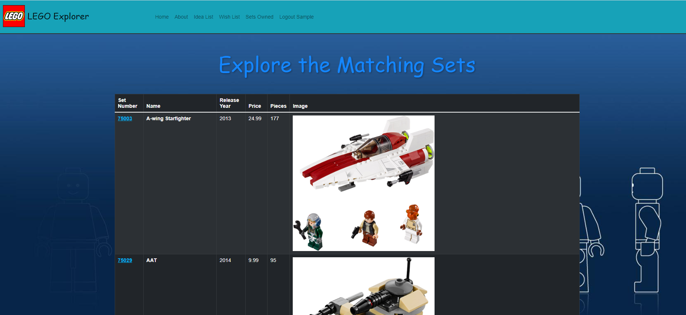
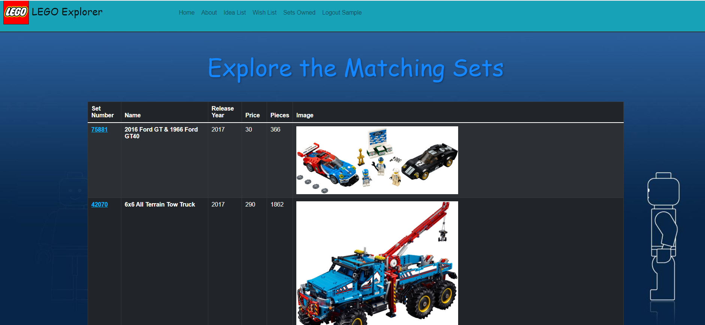
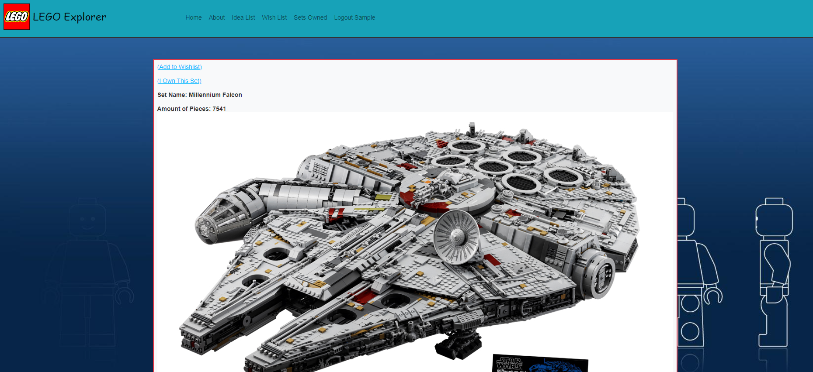
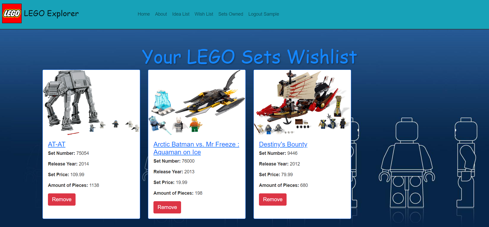
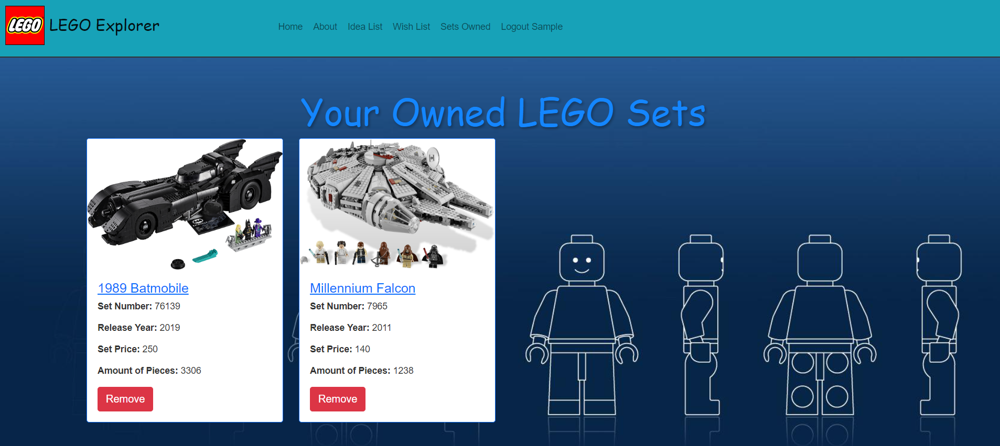

# LEGO Set Finder Website

The goal of this app is to find lego sets from 1964 - 2021 using the filters provided and add them to a wish list or if you already own them to a already owned list. This way if you like collecting lego sets or just like getting them casually you can keep track of what LEGO sets you have or what sets you want to one day buy. The search filters make finding the sets you want much easier. The filters also allow you to simply shop around and determine which set you may want to buy if you can't decide.

# Render Link:
https://legowebsite.onrender.com/

# Web App Preview:

The Main Page which has filters by Name, Theme, and Year. There are also links to view your wish list and owned list on the bottom and as well on the navigation bar for access at any point.

The Main Page:


The Name Filter Page by "Batman":


The Theme Filter Page by "Star Wars":



The Year Filter Page by "2017":



View after clicking on the Set Number link on a specific set:



Wish List after adding a set to the Wish list:



Owned List after adding a set to the Already Owned List:




## Installation
Download the project from github and download nodejs and npm from https://nodejs.org
and cd into the folder

Install the packages with
``` bash
npm install
```
Start the project with
``` bash
node app.js
```
or install nodemon (the node monitoring app) with
``` bash
npm install -g nodemon
```
and start the project with
``` bash
nodemon
```
